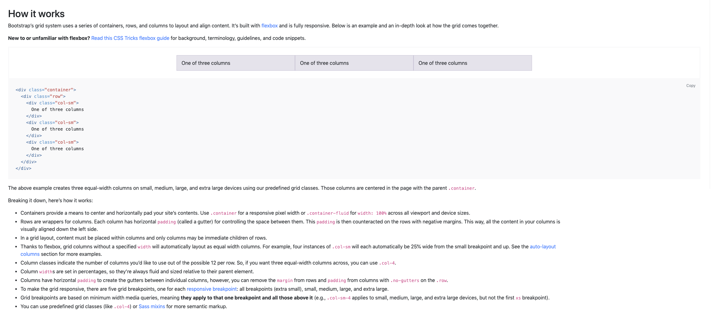
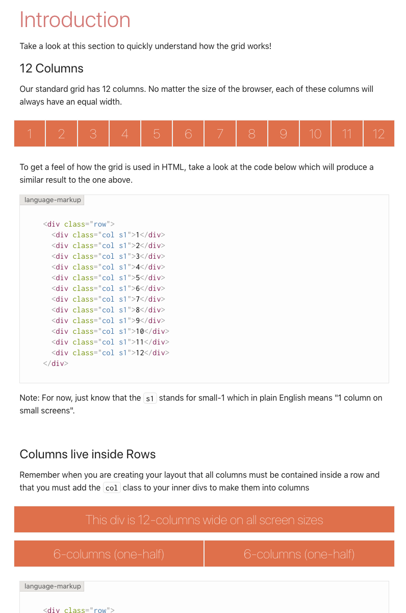
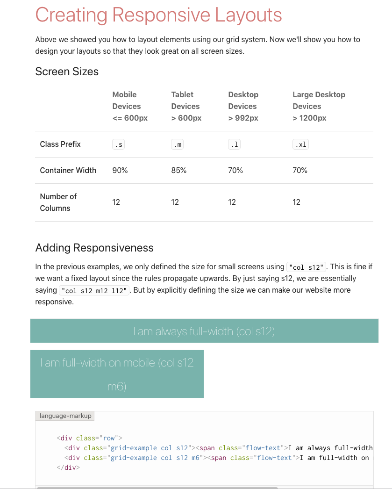

#### Display flexbox

A propriedade de css `display: flex` permite alinhar com facilidade elementos lado a lado.


```html
<nav class="container">
  <div>Home</div>
  <div>Busca</div>
  <div>Sair</div>
</nav>
```

```css
.container {
  display: flex;
}
```

Exercício para treinar e implementar um pouco de flex-box: https://flexboxfroggy.com/#pt-br

***


### Utilizando um Framework/CSS Grid

Pensando em responsividade, vários frameworks de Estilos/CSS já têm sua própria implementação das Grids, como no caso do [Bootstrap](https://getbootstrap.com/docs/4.3/layout/grid/):



Ou do [MaterializeCSS](https://materializecss.com/grid.html):




Ambos os frameworks utilizam o CSS-FlexBox para adicionar responsividade ao site, principalmente quando se trata de breakpoints, já que todos os dois possuem diretrizes (classes) para indicar quantas colunas o elemento deve ocupar quando a resolução da tela for 1024x768, por exemplo.





Para mais informações:

https://www.origamid.com/projetos/css-grid-layout-guia-completo/