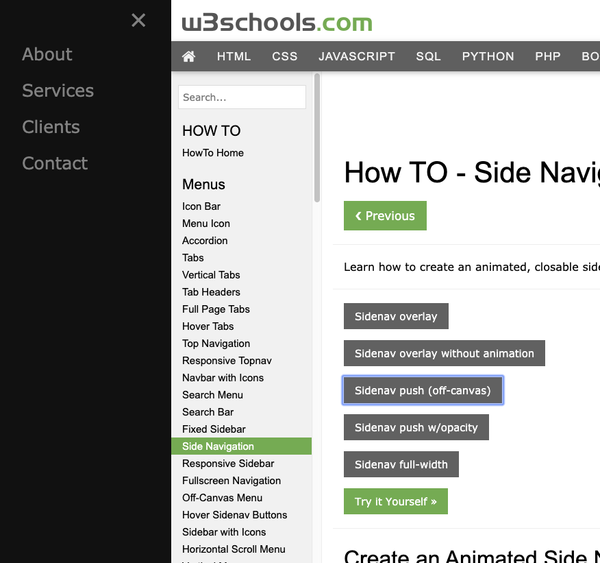

### E por último...

É bem comum você visualizar em sites responsivos a adição de uma gaveta lateral de navegação, como se fosse um menu que consegue ser aberto/fechado com links relevantes.

E para finalizar, vamos adicionar uma barra de navegação lateral (mais conhecida como `drawer` ou gaveta) que permita fazer login/logout.

Para servir como guia, o W3Schools possui dois ótimos exemplos:

https://www.w3schools.com/howto/howto_js_sidenav.asp

https://www.w3schools.com/howto/howto_css_sidebar_responsive.asp

---

#### Para saber mais:

* https://alistapart.com/article/fluidgrids (grid fluido)
* https://developer.mozilla.org/en-US/docs/Web/CSS/Media_Queries/Using_media_queries (media queries)
* http://teknosrc.com/resolution-vs-pixel-density-in-displays-all-you-need-to-know/ (resolução de tela)
* https://fueled.com/blog/iphone-screen-size-screen-resolution/ (tamanho de tela)
* https://css-tricks.com/viewport-sized-typography/
* https://www.w3schools.com/cssref/css_units.asp
* https://css-tricks.com/almanac/properties/f/font-size/
* https://developer.mozilla.org/en-US/docs/Learn/HTML/Multimedia_and_embedding/Responsive_images
* https://medium.freecodecamp.org/learn-css-flexbox-in-5-minutes-b941f0affc34
* https://github.com/reprograma/responsivo