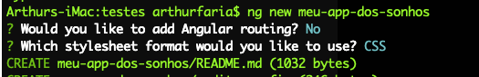
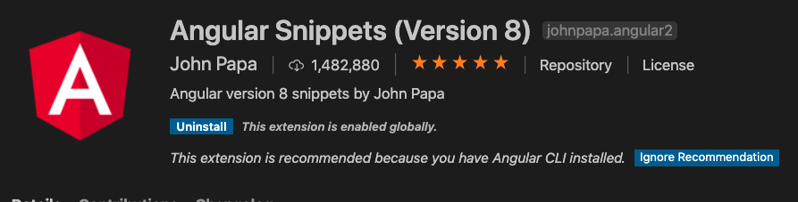

## Angular


Para começar, vamos primeiro instalar globalmente a interface de linha de comando:

```bash
npm install -g @angular/cli@latest
```


E agora, vamos criar uma simples aplicação, não é necessário instalar Rotas e pode escolher o formato de estilos CSS

```bash
ng new meu-app-dos-sonhos
```



Vamos navegar até a pasta

```bash
cd meu-app-dos-sonhos
```

Executar o comando:

```bash
ng serve
```


### Angular vs AngularJs

Angular é uma reescrita do AngularJS.

- Angular não tem um conceito de "escopo" ou controladores, em vez disso, ele usa uma hierarquia de componentes como o seu principal conceito.
- Angular tem uma expressão diferente de sintaxe, concentrando-se no uso de `"[ ]"` para a propriedade de ligação, e no uso de `"( )"` para ligação do evento.
- Modularidade – muito das funcionalidades principais foram movidas para os módulos.
- Angular recomenda o uso da linguagem da Microsoft, o TypeScript, que apresenta as seguintes características:
  - Programação Orientada a Objeto
  - Tipagem Estática
  - Programação genérica
- O TypeScript é um superconjunto do ECMAScript 6 (ES6), e é compatível com ECMAScript 5. Angular também suporta as diretivas do ES6:
  - Lambdas
  - For/Of loops
- Carregamento dinâmico
- Modelo de compilação assíncrono
- A substituição de controladores e `$escopo` com componentes e diretrizes – um componente é uma directiva com um modelo
- Programação reativa de suporte usando RxJS


#### Caso tenha problemas no Windows - Path

```powershell
$env:Path += ";C:\Users\%SEU_USUARIO%\AppData\Roaming\npm"
```

E agora basta executar o comando `.cmd`, no caso:

```bash
ng.cmd new meu-app-dos-sonhos
```


### Utilizando TypeDoc

E claro, como não podemos esquecer, agora vamos também documentar sempre o nosso código utilizando a biblioteca TypeDoc - uma versão do JSDoc para TypeScript!

Para instalar, basta executar o comando:

```bash
npm install --save-dev typedoc
```


E claro, para gerar a documentação, vamos adicionar na seção script do nosso `package.json`:

```json
"docs": "typedoc ./src/app --out docs"
```


