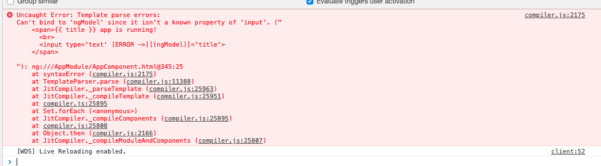
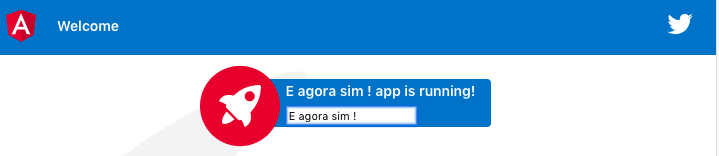

## Data Binding

Uma das grandes facilidades que os frameworks trazem para a programação JS é a camada de abstração do Documento (DOM).

Tudo o que programamos até agora, utilizando o `document.getElementById()`, embora funcione perfeitamente em um JS "raiz", não é hoje a forma mais eficiente de organizar e atualizar a página Web.

Vamos ver então como podemos utilizar o Angular para facilitar um pouco a questão de manipulação do DOM.


Primeiro, vamos alterar o arquivo `app.component.html` e adicionar uma pequena caixa de Texto no parágrafo do título:

```html
<span>{{ title }} app is running!
  <br>
  <input type='text' [(ngModel)]='title' placeholder="Titulo">
</span>
```

Ao adicionar isso em sua página, é provável que não apareça nada. O motivo disso é que nativamente, nem o Browser nem o Angular conseguem entender a diretiva `ngModel`




Para isso, vamos modificar o nosso arquivo `app.module.ts`:

```typescript
import { BrowserModule } from '@angular/platform-browser';
import { NgModule } from '@angular/core';
import { FormsModule } from '@angular/forms'
import { AppComponent } from './app.component';

@NgModule({
  declarations: [
    AppComponent
  ],
  imports: [
    BrowserModule,
    FormsModule
  ],
  providers: [],
  bootstrap: [AppComponent]
})
export class AppModule { }

```




O que  o `ngModel` faz?

```html
 <input
    (input)="title = $event.target.value" 
    [value]="title" 
    placeholder="Titulo">
```

Diretivas são extensões da linguagem HTML, que fornecem a possibilidade de estender/ampliar o comportamento de elementos HTML. Este recurso permite a implementação de novos comportamentos de forma declarativa.


Ao selecionar um elemento HTML, a diretiva pode ampliar seu comportamento de diversas formas:

- para adicionar um novo HTML,
- associar eventos à funções Javascript,
- manipular o DOM.


Se preferir, também pode utilizar uma função:

```typescript
// app.component.ts

export class AppComponent {
  title = 'meu-app-dos-sonhos';
  processador = (title) => {
    return 'O título é: ' + title;
  }
```

```html
<!-- app.component.html -->

<span>{{ processador(title) }} app is running!
      <br>
      <input type='text' 
      (input)="title = $event.target.value" 
      [value]="title" >
    </span>
```


## Exemplo de Diretivas no AngularJS 

| ngBind          | Muda o texto de um elemento HTML automaticamente, de acordo com o seu resultado, vindo das regras de negócio. |
| --------------- | ------------------------------------------------------------ |
| ngModel         | É similar ao ng-bind, mas permite ligação direta bidirecional (two-way data binding ) entre a view e o escopo do aplicativo. |
| ngClass         | Permite atributos de classe serem carregados dinamicamente.  |
| ngClick         | Permite instanciar o evento de click, semelhante ao onclick. |
| ngController    | Especifica um controller JavaScript para aquele HTML em questão. |
| ngRepeat        | Instancia um elemento por item de um array.                  |
| ngShow & ngHide | Mostra ou esconde um elemento HTML de acordo com o resultado de uma expressão booleana. |
| ngSwitch        | Instancia um template, em uma lista de escolhas, dependendo do valor obtido pela expressão. |
| ngView          | A diretiva base para manipulação de rotas, resolvendo um JSON antes de renderizar os modelos acionados por controladores especificados. |
| ngIf            | Declaração básica de um 'if' que permite mostrar um elemento se a condição for verdadeira. |


Vamos fazer um teste então:

```html
<span>{{ title }} app is running!
  <br>
  <input type='text' [(ngModel)]='title' placeholder="Titulo">
  <h3 *ngIf='title.length > 10'> Olhe o tamanho! </h3>
</span>
```

