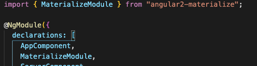

## Estilos

Antes, montamos toda nossa aplicação antes de começar a adicionar estilos, gerando grandes rescritas e adição no final.

Hoje vamos começar diferente, já adicionando um Framework CSS logo no início. Você pode escolher entre o Bootstrap e o MaterializeCSS.


#### Instalando Bootstrap

```bash
npm install --save bootstrap jquery popper
```

E agora, vamos alterar no arquivo `angular.json` na raiz do projeto e adicionar os estilos CSS: 

```json
{
  "$schema": "./node_modules/@angular/cli/lib/config/schema.json",
  "version": 1,
  "newProjectRoot": "projects",
  "projects": {
    "meu-app-dos-sonhos": {
      .
      .
      .
        "test": {
          "builder": "@angular-devkit/build-angular:karma",
          "options": {
            "main": "src/test.ts",
            "polyfills": "src/polyfills.ts",
            "tsConfig": "tsconfig.spec.json",
            "karmaConfig": "karma.conf.js",
            "assets": [
              "src/favicon.ico",
              "src/assets"
            ],
            "styles": [
              "src/styles.css"
            ],
            "scripts": [
              "node_modules/jquery/dist/jquery.js",
              "node_modules/popper.js/dist/umd/popper.js",
              "node_modules/bootstrap/dist/js/bootstrap.js"
            ]
          }
        },
        .
        .
        .
```


E no seu arquivo `./styles.css`

```css
@import '~bootstrap/dist/css/bootstrap.min.css';
```

E para testar:

```html
<div class="input-group mb-3">
  <div class="input-group-prepend">
    <span class="input-group-text" id="basic-addon1">@</span>
  </div>
  <input type="text" [(ngModel)]='title' class="form-control" placeholder="Title" aria-label="Title" aria-describedby="basic-addon1">
</div>
```


#### Instalando MaterializeCSS

Pacote [Materialize](https://www.npmjs.com/package/angular2-materialize):

```bash
npm i angular2-materialize
```



E claro, para testar no seu `app.component.html`

```html
  <br>
  <div class="row">
    <div class="col offset-s3 s6">
      <div class="card blue-grey darken-1">
        <div class="card-content white-text">
          <span class="card-title">{{ processador(title) }}</span>
          <p> 
            <input id="title" type="text" class="white-text" [(ngModel)]='title'>
            <label for="title">Title</label>
        </div>
      </div>
    </div>
  </div>
```


