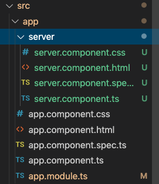
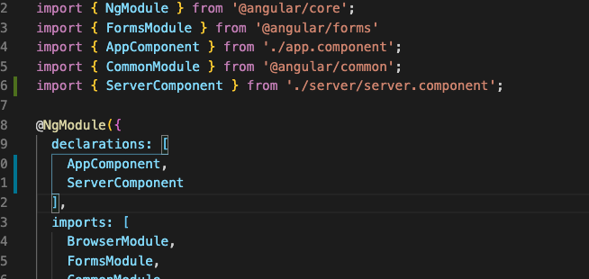
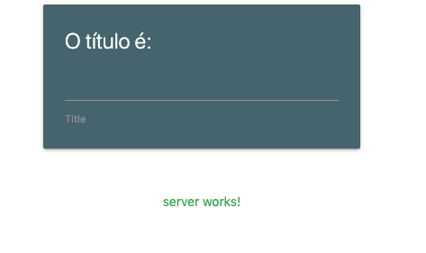

# Criando um componente

A programação Angular se baseia completamente em módulos e componentes, e cada funcionalidade nova que inserimos em nossa aplicação deve se encaixar em um dos dois conceitos.

Agora, vamos adicionar um novo componente para monitorar se o nosso servidor (aquele com Express que a gente criou anteriormente) está funcionando corretamente.

> Caso você não tenha programado ou perdeu o código, disponibilizei uma versão do Express + Json-server em um arquivo zipado na pasta Assets deste laboratório - ou basta [clicar aqui](assets/servidor.zip).


Claro, podemos criar todos os arquivos manualmente, adicionando referências, criando templates... Mas felizmente, a CLI do angular permite que isso seja feito de forma rápida e simples, basta executar o comando:

```bash
ng generate component server
```

ou

```
ng g c server
```


Onde o nome `server` pode ser alterado para o que você desejar.



O comando criará todos os arquivos necessários, além de automaticamente adicionar uma referência ao componente no arquivo `app.module.ts`.

 


E claro, ao visualizarmos o que há dentro do nosso `server.component.ts`

```typescript
import { Component, OnInit } from '@angular/core';

// Decorator de definição de Componente
@Component({
  selector: 'app-server',
  // Também é possível utilizar um template inLine com `template`
  templateUrl: './server.component.html',
  styleUrls: ['./server.component.css']
})
export class ServerComponent implements OnInit {

  constructor() { }

  ngOnInit() {
  }

}
```

> Os decorators oferecem a possibilidade de adicionar metadados e comportamentos a declaração de classes, métodos e propriedades. 
>
> Por padrão os decorators usam a sintaxe `@decoratorName` onde `decoratorName` é uma função que deve ser invocada em tempo de execução.


Agora com nosso componente criado, vamos utilizá-lo no nosso componente principal - o `app.component.html`

```html
  <div class="row" style='width: 100%'>
    <div class='col s12'>
      <app-server></app-server>
    </div>
  </div>
```


  <div class="row">
    <div class='col'>
      <app-server></app-server>
    </div>
  </div>

E ao executarmos, podemos ver na nossa página inicial os dizeres "server works!", que corresponde exatamente com o nosso `server.component.html`.

Vamos alterar um pouco para ajustar melhor os componentes:

```html
<div class='container'>
<p>server works!</p>
</div>

```

E claro, utilizando o nosso arquivo `server.component.css`, podemos adicionar estilos para modificar somente aquele componente. Vamos centralizar o texto de funcionamento então e adicionar uma cor verde para indicar que o servidor está funcionando corretamente:

```css
/* server.component.html */
.container {
    width: 100%;
    text-align: center;
  	color: green;
}
```




Agora podemos ver que o texto mudou de cor além de estar centralizado! E claro, da mesma forma que mexemos com a propriedade `templateUrl`, podemos também definir nosso estilo dentro do componente. (Só lembrar que para estilos, temos que ter um `array` de estilos - strings simples definindo cada estilo).