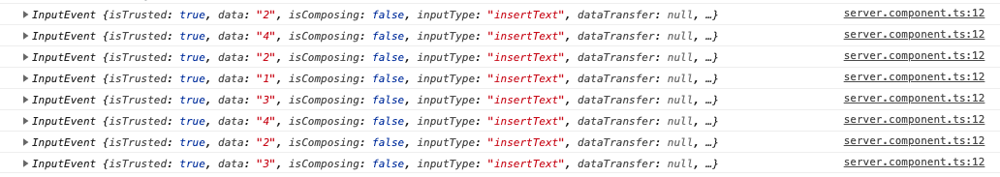
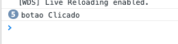

# Data Binding

Two Way Data Binding pode parecer um pouco confuso no início, para aqueles que estão acostumados com a forma que Vanilla ou JQuery leva os dados do Javascript para o DOM e do DOM para o Javascript.

Pois bem, a proposta principal do Two Way Data Binding é automatizar esse trafego de dados, de tal forma que o desenvolvedor não precise mais criar handlers no DOM para atualizar o Javascript e vice versa. Assim, quando um valor no DOM mudar, o Javascript responsável por aquele DOM também vai será atualizado com o respectivo valor automaticamente sem precisar adicionar qualquer handler, como por exemplo:

```
// HTML<input onkeyup=”onChange”>//Javascriptwindow.onChange = function (event){  }
```

Parece algo complicado, né? Mas na verdade é bem simples de ser implementado. :)

A imagem a baixo é um fluxograma de como funciona a lógica de atualização dos dados com Two Way Data Binding:


A imagem a cima cita duas palavras chaves: **View** e **Model**.

Nesse escopo, View seria o DOM e Model seria o Javascript responsável por controlar o fluxo de dados para o DOM.

## Data Binding no Angular

Agora que entendemos um pouco sobre DataBinding, vamos implementar um pouco na nossa aplicação. Para explicar melhor como isso funciona no Angular, vamos dividir o tráfego de dados em duas mãos: saída e entrada.

#### Saída

Quando queremos mostrar alguma informação para o usuário na nossa página Web, o Angular possui duas formas principais de fazer isso: string interpolation e binding de propriedade.

- String Interpolation

  Lembra quando utilizamos o `{{ title }}` lá no começo? Então, isso indica para o framework que ali tem uma variável que deve ser substituída quando a página for renderizada, de forma que sempre seja mostrado o valor da variável `title`. E assim podemos utilizar o que quisermos, como por exemplo:

  ```typescript
  {
    {
      title.length > 10 ? title : "o titulo é muito pequeno";
    }
  }
  ```

- Binding de Propriedade

  E se quisermos alterar alguma propriedade de um componente? Como por exemplo, o `value` de um `input`? Isso é possível com o bind de propriedade. A sintaxe já vimos anteriormente, mas vamos relembrá-la:

  ```html
  <input type="text" [value]="title" />
  ```

  Desta forma, estamos alterando a propriedade do `input` chamada `value` para que tenha o mesmo valor da variável `title`. Lembrando que isso não significa que o que você digitar no `input` será automaticamente passado para a variável.

  E claro, vamos supor que você queria desabilitar um botão, é possível fazer da seguinte forma:

  ```html
  <button [disabled]="title.length < 10">Alterar Titulo</button>
  ```

  E podemos também alterar o HTML interno de um componente:

  ```html
  <p [innerHTML]="title"></p>
  ```

E se quisermos alterar os estilos e classes?

```html
<p [ngStyle]="{backgroundColor : getColor()}"></p>
```

Onde utilizamos um padrão camelCase quando há hífens e temos uma função `getColor()` que retorna uma string válida de cor, como 'white' ou '#FFFFFF'

E claro, também podemos mexer nas classes:

```html
<p [ngClass]="{textWhite: true, textBlack: false}"></p>
```

#### Entrada

Grande parte do input de usuário no JS se dá por eventos. Quando temos um tipo `input`, sempre que o usuário altera o conteúdo da caixa, é chamado um evento `input`. No Angular, para capturamos este evento, basta adicionar `()` ao redor do nome, como vimos anteriormente.

Então, se quisermos recolher o input de um usuário, podemos então escrever o html da forma:

```html
<input type="text" (input)="processaInput($event)" />
```

E lá no nosso `server.component.ts`, podemos definir uma função que recebe um `evento` como parâmetro e imprime no console:

```typescript
  processaInput(evento: Event) {
    console.log(evento)
    let conteudo: string = (<HTMLInputElement>event.target).value;
    console.log(conteudo)
  }
```

Dessa forma, toda vez que houver uma alteração de valor do `input`, temos a impressão do evento no console:



E claro, caso você queira pegar o valor do texto, basta utilizar `$event.target.value`.

Então, se quisermos recolher o input de um usuário, podemos então escrever o html da forma:

```html
<input type="text" (input)="processaInput($event.target.value)" />
```

E lá no nosso `server.component.ts`, podemos definir uma função que recebe um `valor` como parâmetro e imprime no console:

```typescript
  processaInput(valor) {
    console.log(valor)
  }
```

E claro, também podemos chamar uma função quando clicamos em um botão, da forma:

```html
<button (click)="processaInput('botao Clicado')">Clique Aqui!</button>
```



#### Two-Way-Binding

Aqui as coisas começam a ficar interessantes. Lembra que nossos componentes HTML tem uma propriedade `value` que indica o valor do componente e um evento chamado `input` que indica que o valor foi alterado? O Angular já possui uma diretiva que captura automaticamente o valor do componente e altera diretamente o valor da variável assinalada. O nome dessa diretiva é o `[(ngModel)]`, e como possui esse Dual Way, é encapsulado tanto por `[]` quanto por `()`.

```html
<input type="text" [(ngModel)]="nomeDaVariavel" />
```

E importante informar que o `[(ngModel)]` é uma diretiva que pertence ao pacote `@angular/forms`, que deve ser adicionado ao seu `app.module.ts`, como mostrado abaixo:

```typescript
import { BrowserModule } from "@angular/platform-browser";
import { NgModule } from "@angular/core";
// Importação
import { FormsModule } from "@angular/forms";
import { AppComponent } from "./app.component";
import { CommonModule } from "@angular/common";
import { ServerComponent } from "./server/server.component";

@NgModule({
  declarations: [AppComponent, ServerComponent],
  imports: [
    BrowserModule,
    // Utilização
    FormsModule,
    CommonModule
  ],
  providers: [],
  bootstrap: [AppComponent]
})
export class AppModule {}
```
