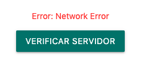
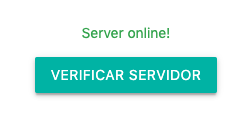
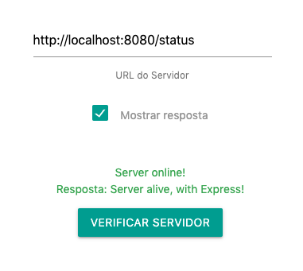

### Adicionando checagem de Servidor


Agora que vimos como é possível recolher inputs de usuário e processar entradas, vamos continuar implementando um componente para checar o status do nosso servidor.

Para fazer as requisições HTTP, vamos instalar novamente nosso velho conhecido `axios`, com o comando

```bash
npm install --save axios
```


Vamos então implementar o componente para que sempre que o usuário pressionar um botão, a verificação do servidor seja feita. Vamos primeiro para o nosso HTML:

```html
<div class='container'>
    <div id='resultado' *ngIf='consultaServer.recolhido'>
            <p class='green-text' *ngIf='consultaServer.serverStatus'>Server online!</p>
            <p class='red-text' *ngIf='!consultaServer.serverStatus'>{{consultaServer.error}}</p>
    </div>
  <!-- O * é utilizado pois a diretiva altera a estrutura do nosso documento -->
    <div id='recolhendo' *ngIf='consultaServer.recolhendo'>
            Verificando servidor...
    </div>
    <button class="btn waves-effect waves-light"(click)="verificaServidor()"  name="action">Verificar Servidor
          </button>
</div>

```

E agora para o nosso `server.component.ts`

```typescript
  consultaServer = {
    serverStatus: false,
    recolhido: false,
    recolhendo: false,
    error: ''
  }
  verificaServidor () {
    this.consultaServer.recolhendo = true
    axios.get('http://localhost:8080/status').then((response) => {
      console.log(response)
      this.consultaServer.serverStatus = true
    }).catch((error) => {
      this.consultaServer.serverStatus = false
      this.consultaServer.error = error
      console.log(error)
    }).finally( () => {
      this.consultaServer.recolhendo = false
      this.consultaServer.recolhido = true
    })
  }
```





E claro, caso você queira simplificar um pouco o `*ngIf` acima, o Angular permite adicionar um `else`, da seguinte forma:

```html
<div *ngIf="condition; then thenBlock else elseBlock"></div>
<ng-template #thenBlock>Content to render when condition is true.</ng-template>
<ng-template #elseBlock>Content to render when condition is false.</ng-template>
```


### Exercício

Adicione um campo de texto no seu componente para que o usuário consiga informar a URL do servidor que quer consultar.

Além disso, adicione um checkBox para que o usuário consiga informar se ele deseja visualizar o retorno do site, como na imagem abaixo:



