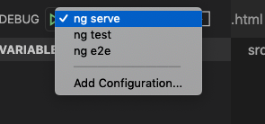
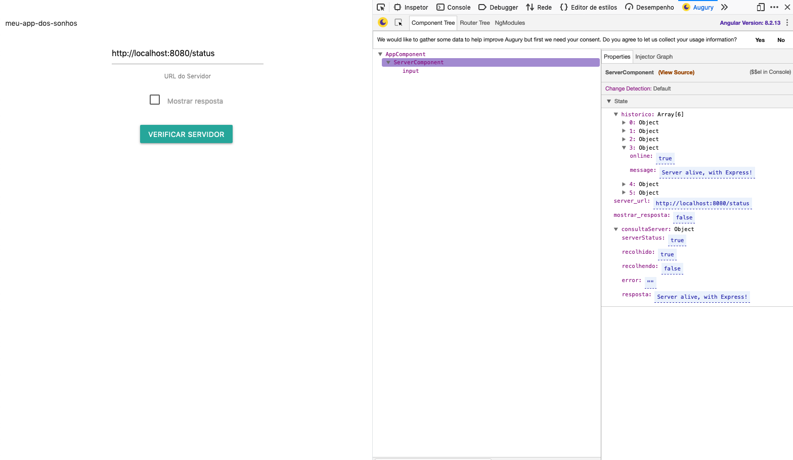

## Começando

- Verifique se o Chrome está instalado corretamente.
- Instale a versão mais recente da extensão [Debugger for Chrome](https://marketplace.visualstudio.com/items?itemName=msjsdiag.debugger-for-chrome) no VS Code.
- Abra a pasta raiz do seu projeto no VSCode


## Configurar launch.json

 

- Sobrescreva o conteúdo do arquivo com a configuração abaixo:

  ```json
  {
    "version": "0.2.0",
    "configurations": [
      {
        "name": "ng serve",
        "type": "chrome",
        "request": "launch",
        "preLaunchTask": "npm: start",
        "url": "http://localhost:4200/#",
        "webRoot": "${workspaceFolder}",
        "sourceMapPathOverrides": {
          "webpack:/*": "${webRoot}/*",
          "/./*": "${webRoot}/*",
          "/src/*": "${webRoot}/*",
          "/*": "*",
          "/./~/*": "${webRoot}/node_modules/*"
        }
      },
      {
        "name": "ng test",
        "type": "chrome",
        "request": "launch",
        "url": "http://localhost:9876/debug.html",
        "webRoot": "${workspaceFolder}",
        "sourceMaps": true,
        "sourceMapPathOverrides": {
          "webpack:/*": "${webRoot}/*",
          "/./*": "${webRoot}/*",
          "/src/*": "${webRoot}/*",
          "/*": "*",
          "/./~/*": "${webRoot}/node_modules/*"
        }
      },
      {
        "name": "ng e2e",
        "type": "node",
        "request": "launch",
        "program": "${workspaceFolder}/node_modules/protractor/bin/protractor",
        "protocol": "inspector",
        "args": ["${workspaceFolder}/e2e/protractor.conf.js"]
      }
    ]
  }
  ```

  >  **Please note**: Running `npm start` instead of `ng serve` ensures the app is served with the version of @angular/cli specified in package.json.

  E na mesma pasta do `launch.json`, adicione um arquivo chamado `tasks.json`com o conteúdo abaixo:

  ```json
  {
    "version": "2.0.0",
    "tasks": [
      {
        "type": "npm",
        "script": "start",
        "isBackground": true,
        "presentation": {
          "focus": true,
          "panel": "dedicated"
        },
        "group": {
          "kind": "build",
          "isDefault": true
        },
        "problemMatcher": {
          "owner": "typescript",
          "source": "ts",
          "applyTo": "closedDocuments",
          "fileLocation": [
            "relative",
            "${cwd}"
          ],
          "pattern": "$tsc",
          "background": {
            "activeOnStart": true,
            "beginsPattern": {
              "regexp": "(.*?)"
            },
            "endsPattern": {
              "regexp": "Compiled |Failed to compile."
            }
          }
        }
      },
    ]
  }
  ```

  

  

  

  ## Debug Unit Tests

- Adicione um breakpoint no arquivo **app.component.spec.ts**.

- Abra um terminal e execute os testes com o comando abaixo:

  > **Please note**: Running `npm run test` instead of `ng test` ensures tests are run with the version of @angular/cli specified in package.json.

  ```
  npm run test
  ```

- Depois de executar os testes, vá até a aba de Debug e selecione a configuração `ng test`, apertando F5 ou simplesmente o play.

- Quando o navegador abrir com a lista dos testes, clique no link para o teste que quer debugar e você deve chegar no breakpoint.


## Debug End-to-end Tests

You can also debug your end-to-end tests running in Protractor with VS Code.

1. Start 'Angular Live Development Server' by starting a debug session in VS Code with our **'ng serve'** configuration we created above. Alternatively, and as mentioned above, executing `ng serve` command in terminal will also run the development server but without having VS Code running a debug session for it.

2. Set a breakpoint in **app.e2e-spec.ts** on a line in one of the end-to-end tests.

3. Now go to the Debug view in VS Code, select the **'ng e2e'** configuration, then press F5 or click the green button to run Protractor in a debug session.

Notice: You might need to update the `"protocol"` property to `legacy` if you are using an older version of Node (older than Node 8)


## Augury

Se preferir uma abordagem mais visual, sem precisar de breakpoints para analisar o estado das variáveis e telas, a extensão [Augury](https://augury.rangle.io/) pode lhe ajudar.


