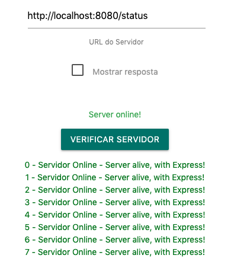
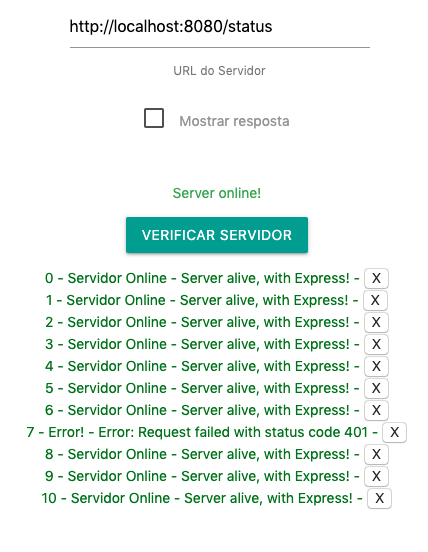

## ngFor

Nos últimos passos, implementamos um simples componente que checa se o Servidor está ou não Online, informando para nós a resposta da chamada.

Agora, vamos manter um histórico de todas as chamadas e mostra-las em uma lista, utilizando a diretiva `ngFor`.

Primeiro, vamos criar um array no nosso arquivo do componente para armazenar as respostas, vamos chamá-lo de `histórico`.

```typescript
historico = []
```

Agora, vamos alterar nossas chamadas para que sempre seja adicionada a resposta ao array. Para facilitar e implementar uma classe para organizar as consultas, vamos criar um arquivo `Consulta.ts` na pasta do nosso componente e adicionar o código:

```typescript
export class Consulta {
    online: boolean;
    message: string;
    constructor (online: boolean, message: string) {
      this.online = online
      this.message = message
    }
  }
```

E claro, agora podemos importar no nosso arquivo do componente e utilizar:

```typescript
import { Consulta } from './consulta'
.
.
.
historico = []
verificaServidor () {
    this.consultaServer.recolhendo = true
    axios.get(this.server_url).then((response) => {
      this.consultaServer.serverStatus = true
      this.consultaServer.resposta = response.data
      this.historico.push(new Consulta(true, response.data))
    }).catch((error) => {
      this.consultaServer.serverStatus = false
      this.consultaServer.error = error
      this.historico.push(new Consulta(false, error))
    }).finally( () => {
      this.consultaServer.recolhendo = false
      this.consultaServer.recolhido = true
    })
  }
```

Agora, toda vez que clicarmos no botão para fazer a verificação, a resposta será salva no Array. Vamos ver então como mostrar o Array para o usuário.

Como é possível ver abaixo, é extremamente simples adicionar dinamicamente componentes no DOM utilizando o `*ngFor`:

```html
<ul>
  <li *ngFor="let consulta of historico">
    {{ consulta.online ? 'Servidor Online' : 'Error!' }} - 
    {{ consulta.message }}
  </li>
</ul>
```

E claro, também é possível acessar o `index` (a posição do elemento no Array) da seguinte forma:

```html
<ul>
	<li *ngFor="let consulta of historico; let i = index">
  	{{ i }} - 
  	{{ consulta.online ? 'Servidor Online' : 'Error!' }} - 
  	{{ consulta.message }}
	</li>
</ul>
```



E aí temos então a lista completa de todos as chamadas feitas.


## Exercício

Utilizando as diretivas e o *ngFor, adicione uma opção para remover uma chamada, simplesmente apagando-a do array `histórico`. 

Para facilitar, o array no JS possui um método que permite remover um item em especificado index, no formato:

```js
array.splice(index, 1);
```

Onde index se refere à posição e '1' se refere a quantos elementos devem ser retirados começando pelo `index`.

Você pode então utilizar estruturas como:

```html
<button (click)="apagaHistorico(index)">Apagar</button>
```


