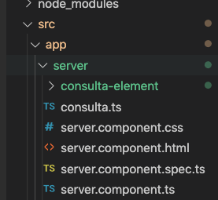

## Propriedades Customizadas

No documento anterior, vimos como criar uma classe e utilizar o `*ngFor` para iterar sobre um array de objetos. Mas e se quiséssemos adicionar mais coisas à lista de histórico? Ou até mesmo deixá-la mais independente?

Primeiro, vamos adicionar uma nova propriedade à nossa classe de consulta para que possamos recuperar a data em que aquela consulta foi gravada:

```typescript
// consulta.ts
export class Consulta {
    online: boolean;
    message: string;
    date: number;
    constructor (online: boolean, message: string) {
      this.online = online
      this.message = message
      this.date = Date.now()
    }
  }
```


E agora vamos criar um novo componente chamado `consulta-element`, com o comando:

```bash
ng g c server/consulta-element --spec false
```



Isso irá criar um novo componente dentro da nossa pasta `server`, para deixar o código fonte organizado principalmente no quesito hierarquia.

O ideal seria se este elemento recebesse um tipo Consulta como propriedade e mostrasse na tela. E é exatamente isso que faremos:

```typescript
// consulta-element.component.ts
import { Component, OnInit, Input } from '@angular/core';
import { Consulta } from '../consulta';
@Component({
  selector: '[app-consulta-element]',
  templateUrl: './consulta-element.component.html',
  styleUrls: ['./consulta-element.component.css']
})
export class ConsultaElementComponent implements OnInit {

  @Input () consulta: Consulta;
  @Input ('indice') index: number;
  constructor() { }

  ngOnInit() {
  }
 formataData (data) {
   let momento = new Date(data)
   return momento.getHours() + ':' + momento.getMinutes() + ':' + momento.getSeconds()
 }
}
```

Vamos também definir duas classes no nosso arquivo `consulta-element.component.css`

```css
.sucesso {
    color: green;
}
.erro {
    color: red;
}
```

E agora o `consulta-element.component.html`

```html
<div style='text-align: left;'>
    <span class="title" [ngClass]="{ sucesso: consulta.online, erro: !consulta.online}">{{index}} - {{ consulta.online ? 'Online': 'Offline'}}
        <span class="new badge" [ngClass]="{ red: !consulta.online, green: consulta.online}"
            data-badge-caption="">{{ formataData(consulta.date) }}</span>
        <p style='color: grey; font-size: 0.8em'>
            {{consulta.message}}
        </p>
    </span>

</div>
```

E por último, o nosso `server.component.html`

```html
<div class='container'>
    <div class="input-field inline" style='width: 300px'>
        <input id="url_inline" type="url" [(ngModel)]='server_url' class="validate">
        <span class="helper-text" data-error="wrong" data-success="right">URL do Servidor</span>
    </div>
    <p>
        <label>
            <input type="checkbox" class="filled-in" [checked]="mostrar_resposta"
                (input)='mostrar_resposta = $event.target.checked' />
            <span>Mostrar resposta</span>
        </label>
    </p>
    <br>
    <div id='resultado' *ngIf='consultaServer.recolhido'>
        <p class='green-text' *ngIf='consultaServer.serverStatus'>Server online!
            <br>
            {{ mostrar_resposta ? 'Resposta: ' + consultaServer.resposta : ''}}
        </p>
        <p class='red-text' *ngIf='!consultaServer.serverStatus'>{{consultaServer.error}}</p>
    </div>
    <div id='recolhendo' *ngIf='consultaServer.recolhendo'>
        Verificando servidor...
    </div>
    <button class="btn waves-effect waves-light" (click)="verificaServidor()" name="action">Verificar Servidor
    </button>
    <ul class="collection">
        <li app-consulta-element class="collection-item" *ngFor="let consulta of historico; let i = index"
            [consulta]="consulta" [indice]="i">
        </li>
    </ul>
</div>
```

