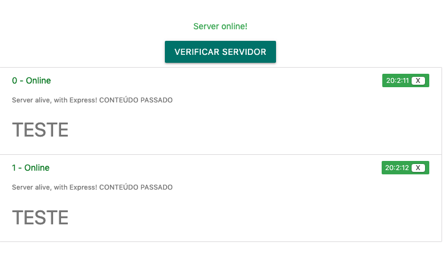

## ngContent

`server.component.html`

```html
<ul class="collection">
  <li app-consulta-element class="collection-item" *ngFor="let consulta of historico; let i = index" [consulta]="consulta" [indice]="i" (deleteConsulta)="onDeleteConsulta($event)">
    CONTEÚDO PASSADO
    <h4>
      TESTE
    </h4>
  </li>
</ul>
```

`consults-element.component.html`

```html
<div style='text-align: left;'>

    <span class="title" [ngClass]="{ sucesso: consulta.online, erro: !consulta.online}">{{index}} -
        {{ consulta.online ? 'Online': 'Offline'}}
        <span class="new badge" [ngClass]="{ red: !consulta.online, green: consulta.online}"
            data-badge-caption="">{{ formataData(consulta.date) }} <button (click)='onDeleteConsulta(index)'>
                X
            </button></span>
        <p style='color: grey; font-size: 0.8em'>
            {{consulta.message}}
            <ng-content></ng-content>
        </p>
    </span>
</div>
```



