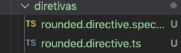
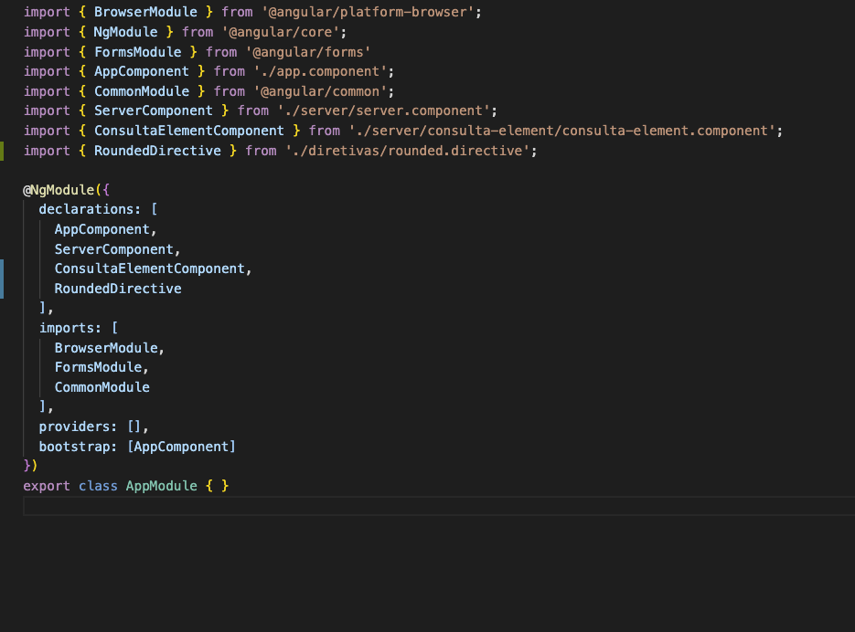
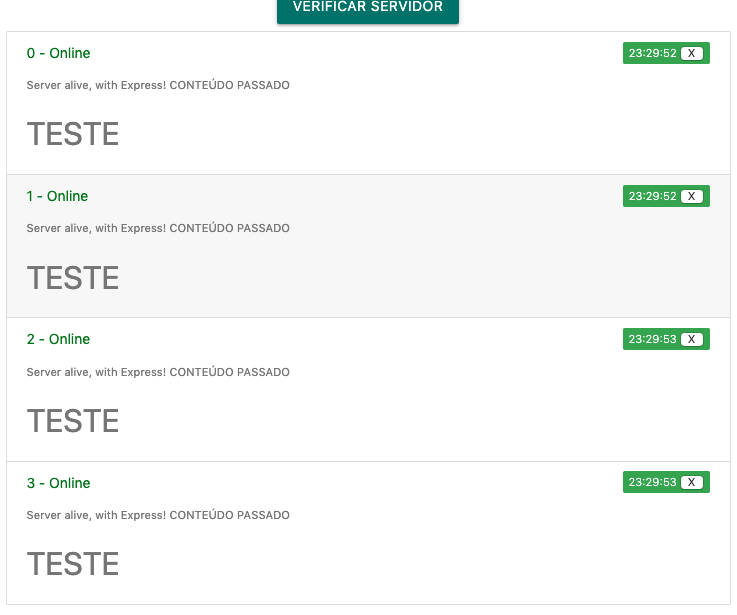
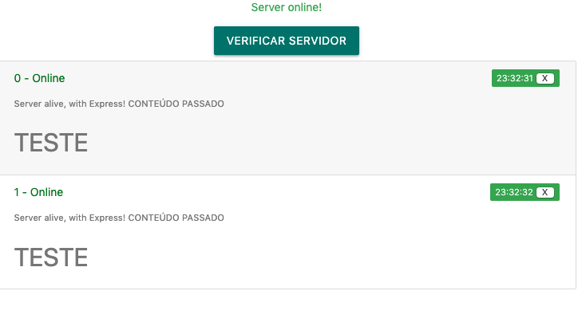

## Diretivas customizadas

Quando trabalhamos com componentes, já vimos que o Angular possui diretivas padrão para manipular e modificar as tags HTML. Agora, vamos ver como criar uma nova diretiva (responsável por arredondar os cantos) chamada `rounded`.

Vamos começar utilizando o nosso terminal e criando uma nova diretiva, com o comando:

```bash
ng g d diretivas/rounded
```

Isso deve criar 2 arquivos dentro da pasta diretivas:



O componente em si e um arquivo .spec para testes. Neste momento, podemos excluir o .spec e continuar somente com o `rounded.directive.ts`.

Se o comando foi executado com sucesso, além de criar os dois arquivos, também foram adicionadas referências no arquivo `app.module.ts`




Agora, vamos começar a programar nosso arquivo `rounded.directive.ts`:

```typescript
import { Directive, OnInit, ElementRef, Renderer2 } from '@angular/core';
// Mais sobre o Renderer2 pode ser encontrado aqui -> https://angular.io/api/core/Renderer2
@Directive({
  selector: '[appRounded]'
})
export class RoundedDirective implements OnInit {

  constructor(private elementRef: ElementRef, private renderer: Renderer2) { }

  ngOnInit () {
    this.renderer.setStyle(this.elementRef.nativeElement, 'border-radius', '10px');
  }

}
```

E agora, se aplicarmos as diretivas no nosso `server.component.html`, poderemos ver o resultado:

```html
<ul class="collection" appRounded>
        <li app-consulta-element class="collection-item" *ngFor="let consulta of historico; let i = index" consulta]="consulta" [indice]="i" (deleteConsulta)="onDeleteConsulta($event)" appRounded>
            CONTEÚDO PASSADO
            <h4>
              TESTE
            </h4>
        </li>
    </ul>
```


Mas consigo sobrescrever o valor de `border-radius` caso eu queira? Claro! Vamos utilizar o Decorator `@input()` e definir uma propriedade com mesmo nome `appRounded`:

```typescript
import { Directive, OnInit, ElementRef, Renderer2, Input } from '@angular/core';

@Directive({
  selector: '[appRounded]'
})
export class RoundedDirective implements OnInit {

  constructor(private elementRef: ElementRef, private renderer: Renderer2) { }

  @Input() appRounded: string = '10px';
  ngOnInit () {
    this.renderer.setStyle(this.elementRef.nativeElement, 'border-radius', this.appRounded);
  }

}
```

E finalmente, podemos fazer o bind direto:

```html
<ul class="collection" [appRounded]='"60px"'>
        <li app-consulta-element class="collection-item" *ngFor="let consulta of historico; let i = index" [consulta]="consulta" [indice]="i" (deleteConsulta)="onDeleteConsulta($event)" [appRounded]='"60px"'>
        </li>
    </ul>
```

Podemos ver que por `default` temos o border-radius de 10px, mas é possível alterar passando como parâmetro diretamente! A única questão que temos que prestar atenção é que o [appRounded] recebe uma string e não uma expressão, por isso a necessidade de "encapsular" o "60px".


### Trocando Background em `mouseenter`

#### Com HostListener

As diretivas em Angular também permitem adicionar funções ligadas a eventos que alteram o comportamento do DOM. Agora, vamos utilizar o decorator `HostListener` para escutar por eventos do nosso elemento.

Vamos adicionar uma função que quando o usuário passar o mouse em cima, o background da `<li>` ficará um pouco mais escuro e quando o mouse sair, voltará a ser o que era.

```typescript
import { Directive, OnInit, ElementRef, Renderer2, Input, HostListener } from '@angular/core';

@Directive({
  selector: '[appRounded]'
})
export class RoundedDirective implements OnInit {

  constructor(private elementRef: ElementRef, private renderer: Renderer2) { }

  @Input() appRounded: string = '10px';
  ngOnInit () {
    this.renderer.setStyle(this.elementRef.nativeElement, 'border-radius', this.appRounded);
  }
  @HostListener('mouseenter') mouseOver (event: Event) {
    this.renderer.setStyle(this.elementRef.nativeElement, 'background-color', '#F8F8F8');
  }
  @HostListener('mouseleave') mouseLeave (event: Event) {
    this.renderer.setStyle(this.elementRef.nativeElement, 'background-color', 'white');
  }
}

```





#### Com HostBinding

```typescript
import { Directive, OnInit, ElementRef, Renderer2, Input, HostListener, HostBinding } from '@angular/core';

@Directive({
  selector: '[appRounded]'
})
export class RoundedDirective implements OnInit {

  constructor(private elementRef: ElementRef, private renderer: Renderer2) { }
  @HostBinding('style.backgroundColor') backgroundColor: string;

  @Input() appRounded: string = '10px';
  ngOnInit () {
    this.renderer.setStyle(this.elementRef.nativeElement, 'border-radius', this.appRounded);
  }
  @HostListener('mouseenter') mouseOver (event: Event) {
    this.backgroundColor = "#F8F8F8";
  }
  @HostListener('mouseleave') mouseLeave (event: Event) {
    this.backgroundColor = "white";
  }
}

```




## Exercício

Utilizando o código acima, adicione a opção de configurar a cor de `mouseOver` assim como alteramos o valor do `border-radius`.


### Extra: DropDown

```typescript
import {Directive, ElementRef, HostBinding, HostListener} from '@angular/core';
 
@Directive({
  selector: '[appDropdown]'
})
export class DropdownDirective {
  @HostBinding('class.open') isOpen = false;
  @HostListener('document:click', ['$event']) toggleOpen(event: Event) {
    this.isOpen = this.elRef.nativeElement.contains(event.target) ? !this.isOpen : false;
  }
  constructor(private elRef: ElementRef) {}
}
```

```html
 <ul class="nav navbar-nav navbar-right">
        <li class="dropdown" appDropdown>
          <a href="#" class="dropdown-toggle" role="button">Manage <span class="caret"></span></a>
          <ul class="dropdown-menu">
            <li><a href="#">Save Data</a></li>
            <li><a href="#">Fetch Data</a></li>
          </ul>
        </li>
      </ul>
```

