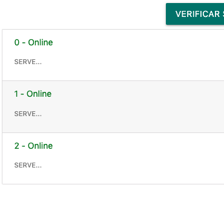

## Pipes

Os famosos `pipes` são responsáveis por processar um Input e retorná-lo da forma desejada. Já vimos estruturas parecidas nos terminais, o caracter `|`. E no Angular, os pipes seguem a mesma ideia.

Por exemplo, se quisermos que nossa string seja impressa no DOM com todas as letras maiúsculas, basta colocar o código:

```html
{{ stringMinuscula | uppercase }}
```

Dessa forma, o conteúdo de `stringMinuscula` é mostrado na tela com todas as letras em UpperCase. Seria a mesma coisa de escrever por exemplo `stringMinuscula.toUpperCase()`, então essa pipe é só um exemplo de processador.

Também podemos formatar datas, nomes, strings, tudo disponível no site do [Angular - Pipes](https://angular.io/guide/pipes), mas para facilitar, um exemplo de formatação de `data` é:

```
{{ birthday | date:"MM/dd/yy" }}
```


E que tal criar nossa própria Pipe? O objetivo dela vai ser truncar nossa string e adicionar `...` caso o tamanho dela seja superior ao definido. No caso, vamos aplicar essa pipe no retorno da chamada ao servidor, a `consulta.messsage`.


Para começar, vamos executar o comando:

```bash
ng g p pipes/truncate
```

Desta forma, o angular/cli já criará todos os arquivos necessários além de adicionar as referências no nosso `app.module.ts`.

E no nosso `truncate.pipe.ts`, podemos utilizar o código:

```typescript
import { Pipe, PipeTransform } from '@angular/core';

@Pipe({
  name: 'truncate'
})
export class TruncatePipe implements PipeTransform {

  transform(value: string, size: number = 20): any {
    // Trunca strings para tamanho 20.
    if (value.length > size) {
      return value.substring(0, size) + '...'
    }
    return value;
  }

}
```

E se modificarmos nosso componente que mostra a consulta:

```
 {{consulta.message | truncate: 5}}
```

Vamos ter saídas do tipo:


E claro, seja para filtrar letras, formatar saída, corrigir erros, os pipes podem ser utilizados para inúmeras coisas, inclusive concatená-los:

```
 {{consulta.message | truncate: 5 | uppercase }}
```

