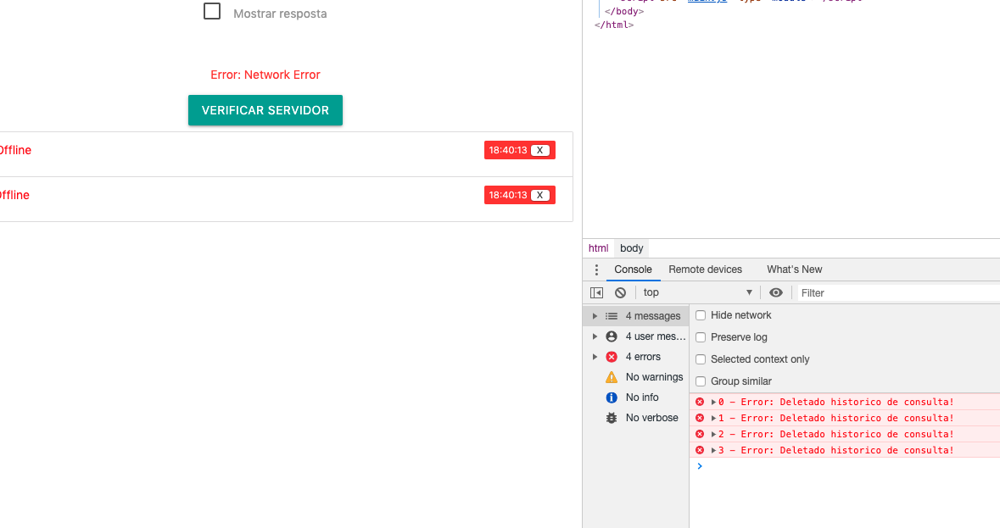
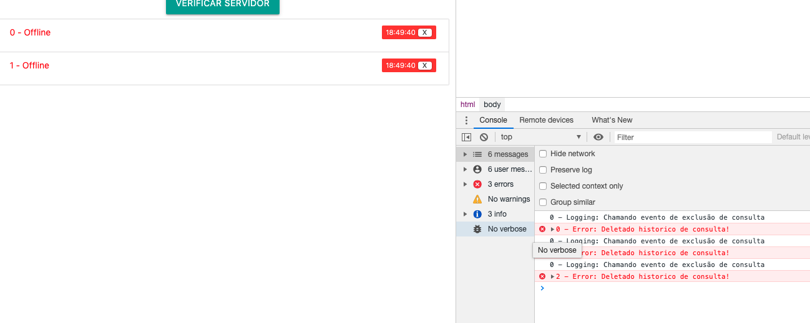
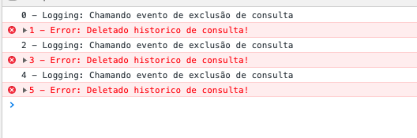

## Serviços

Os serviços em Angular vão funcionar como componentes/módulos que têm seus métodos expostos para quem os utilizar. Desta forma, podemos centralizar trechos de código que seriam repetidos nas mais variadas camadas da aplicação em um só lugar.

Para exemplo, vamos implementar um serviço de Log, permitindo que todos nossos componentes gravem informações no Log.

E claro, assim como todos os outros componentes criados anteriormente, podemos utilizar o comando

```shell
ng g s logging
```

Desta forma, estamos utilizando a CLI do Angular (ng) para gerar (g) um serviço (s) chamado `logging`.

Isso deve criar dois arquivos na raiz do nosso projeto, vamos ver seu conteúdo:

```typescript
import { Injectable } from '@angular/core';

@Injectable({
  providedIn: 'root'
})
export class LoggingService {
  private *getId() {
    let i = 0;
    while (true) {
      yield i++;
    }
  }
	const idGenerator = this.getId();
    // Adicionando função de logging
  addToLog(value: string, success: boolean = true) {
    if (success)
      console.log(this.idGenerator.next().value + ' - Logging: ' + value);
    else
      console.error(this.idGenerator.next().value + ' - Error: ' + value);
  }
  constructor() { }
}
```

Perceba que temos o Decorator `@Injectable`, que segundo a documentação oficial indica que a classe é utilizada como dependência injetável.


>Determines which injectors will provide the injectable, by either associating it with an @NgModule or other `InjectorType`, or by specifying that this injectable should be provided in the 'root' injector, which will be the application-level injector in most apps.


E como utilizamos isso? O framework Angular possui propriedades do decorator `@Component` que nos permite injetar dependências de forma concisa e prática através da chave `providers`. Basta importar o serviço e utilizá-lo como parâmetro do construtor, da seguinte maneira:

```typescript
// server.component.ts
...
import { LoggingService } from '../logging.service';

@Component({
  selector: 'app-server',
  templateUrl: './server.component.html',
  styleUrls: ['./server.component.css'],
  providers: [LoggingService]
})
...

  constructor(private logginService: LoggingService) { }
  onDeleteConsulta (event) {
    this.logginService.addToLog('Deletado historico de consulta!', false);
    this.historico.splice(event.index, 1)
  }
  
  ...
```



E se quisermos também adicionar ao Log quando clicarmos no botão de remover? Podemos também injetar no nosso componente de consulta:

```typescript
// consulta-element.component.ts
import { Component, OnInit, Input, EventEmitter, Output, ViewEncapsulation } from '@angular/core';
import { Consulta } from '../consulta';
import { LoggingService } from 'src/app/logging.service';
@Component({
  selector: '[app-consulta-element]',
  templateUrl: './consulta-element.component.html',
  styleUrls: ['./consulta-element.component.css'],
  providers: [LoggingService],
  encapsulation: ViewEncapsulation.Emulated // Native, None
})
export class ConsultaElementComponent implements OnInit {

  @Input () consulta: Consulta;
  @Input ('indice') index: number;
  @Output() deleteConsulta = new EventEmitter<{index: number}>();
  constructor(private logginService: LoggingService) { }

  ngOnInit() {
  }
  onDeleteConsulta (index) {
    this.logginService.addToLog('Chamando evento de exclusão de consulta')
    this.deleteConsulta.emit({index});
  }
 formataData (data) {
   let momento = new Date(data)
   return momento.getHours() + ':' + momento.getMinutes() + ':' + momento.getSeconds()
 }
}
```



E agora, mesmo injetando o serviço em dois componentes, Houston, temos um problema! Queremos que o serviço funcione da mesma forma para os dois e claramente não é isso que está acontecendo!

Quando injetamos de forma direta e não hierárquica nos nossos componentes, temos exatamente isso, um erro durante as chamadas e execução do serviço que deveria ser compartilhado. E como nosso componente que mostra as consultas é inicializado toda vez, temos sempre um Log de ID 0!

Podemos então injetar somente uma vez no componente pai `server.component.ts` e apenas utilizar a injeção de dependência no nosso `consulta-element.component.ts`:

```typescript
// consulta-element.component.ts
import { Component, OnInit, Input, EventEmitter, Output, ViewEncapsulation } from '@angular/core';
import { Consulta } from '../consulta';
import { LoggingService } from 'src/app/logging.service';
@Component({
  selector: '[app-consulta-element]',
  templateUrl: './consulta-element.component.html',
  styleUrls: ['./consulta-element.component.css'],
  encapsulation: ViewEncapsulation.Emulated // Native, None
})
export class ConsultaElementComponent implements OnInit {

  @Input () consulta: Consulta;
  @Input ('indice') index: number;
  @Output() deleteConsulta = new EventEmitter<{index: number}>();
  constructor(private logginService: LoggingService) { }

  ngOnInit() {
  }
  onDeleteConsulta (index) {
    this.logginService.addToLog('Chamando evento de exclusão de consulta')
    this.deleteConsulta.emit({index});
  }
 formataData (data) {
   let momento = new Date(data)
   return momento.getHours() + ':' + momento.getMinutes() + ':' + momento.getSeconds()
 }
}	
```



Agora sim! E claro, caso seja necessário adicionar de forma global nosso Serviço, basta adicioná-lo ao arquivo `app.module.ts`!


## Exercício

Crie um serviço para gerenciar o histórico de consultas, centralizando toda a orquestração em um só lugar. Você deve utilizar o gerador de ID para adicionar um identificador único à consulta, facilitando sua manipulação.

Será preciso:

- Alterar/Adicionar a interface de Consulta
- Adicionar um novo serviço
- Refatorar o código já feito
- Definir métodos de adição/remoção de consulta