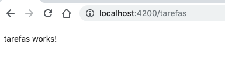
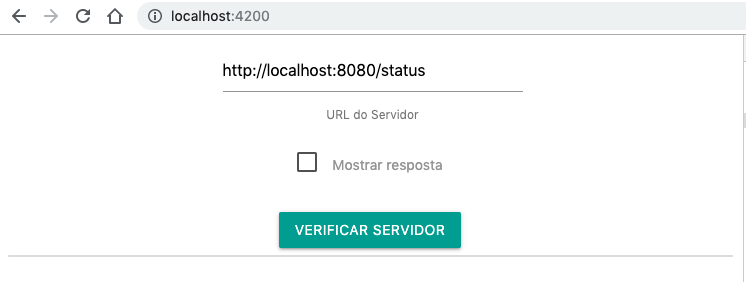
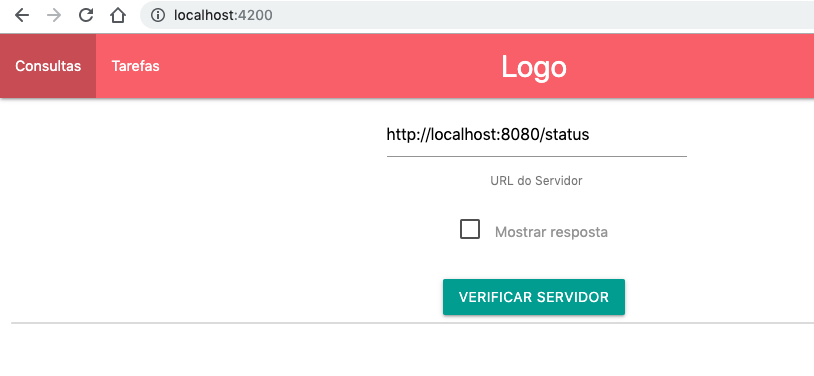
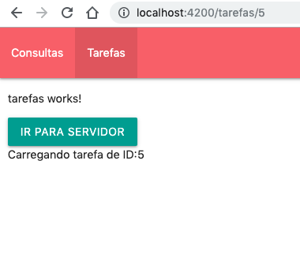

## Trabalhando com Rotas

#### Iniciando

> Disclaimer

Caso você não tenha inicializado o seu projeto com Rotas, basta adicionar o seguinte arquivo na pasta `app` com o nome de `app-routing.module.ts` 

```typescript
import { NgModule } from '@angular/core';
import { Routes, RouterModule } from '@angular/router';
import { ServerComponent } from './server/server.component'

const routes: Routes = [
  {
    path: '',
    component: ServerComponent
  }
];

@NgModule({
  imports: [RouterModule.forRoot(routes)],
  exports: [RouterModule]
})
export class AppRoutingModule { }

```

e importá-lo no `app.module.ts`:

```typescript
...
import { AppRoutingModule } from './app-routing.module';

@NgModule({
  declarations: [
    AppComponent,
    ServerComponent,
    ConsultaElementComponent,
    RoundedDirective,
    TruncatePipe
  ],
  imports: [
    BrowserModule,
    FormsModule,
    CommonModule,
    AppRoutingModule
  ],
  providers: [],
  bootstrap: [AppComponent]
})
export class AppModule { }

```


### Criando componentes para teste

Até o momento, só temos um componente raiz que monta toda nossa árvore do DOM, o ServerComponent. Note que ele já está referenciado na nossa Rota, portanto, assim que iniciarmos nosso projeto ele deve aparecer por padrão.

Mas agora, vamos criar um novo componente para adicioná-lo à rota, chamado de `tarefas`. Como já vimos, o comando para criar:

```bash
ng g c tarefas/tarefas
```

E agora, vamos adicionar uma nova rota no nosso array referenciando o novo componente:

```typescript
const routes: Routes = [
    {
      path: '',
      component: ServerComponent
    },
    {
    	path: 'tarefas',
    	component: TarefasComponent
    }
  ];
```

E agora vamos alterar o nosso `app.component.html`(a raiz do nosso projeto) para que possa receber o carregamento das rotas:

```html
  <div class="row" style='width: 100%'>
    <div class='col s12'>
      <!-- removendo o app-server e adicionando router-outlet <app-server></app-server> -->
      <router-outlet></router-outlet>
    </div>
  </div>
```

E agora, se acessarmos o `localhost:4200/tarefas` teremos o seguinte resultado:



E claro, se acessarmos o `localhost:4200` teremos então:



### routerLink

Claro, não queremos que nosso usuário fique sempre alterando a URL e recarregando toda nossa aplicação, por isso vamos implementar um `routerLink`.

Para isso, vamos adicionar um `navbar` ao nosso AppComponent (raiz da nossa aplicação):

```html
  <nav>
    <div class="nav-wrapper">
      <a href="#!" class="brand-logo center">Logo</a>
      <ul class="left hide-on-med-and-down">
        <li routerLinkActive="active"
            [routerLinkActiveOptions]="{exact: true}"><a routerLink='/'>Consultas</a></li>
        <li routerLinkActive="active"><a [routerLink]='"/tarefas"'>Tarefas</a></li>
      </ul>
    </div>
  </nav>
  <div class="row" style='width: 100%'>
    <div class='col s12'>
      <!-- removendo o app-server e adicionando router-outlet <app-server></app-server> -->
      <router-outlet></router-outlet>
    </div>
  </div>
```




E claro, também podemos fazer a chamada de forma programática. Para isso, vamos adicionar um botão no nosso componente de `tarefas` para que possamos redirecionar para a raiz da aplicação:

```html
<p>tarefas works!</p>
<button class="btn waves-effect waves-light" (click)='irParaServidores()'>
        Ir para servidor
</button>
```

> E criar então um novo método no `.ts`:

```typescript
import { Component, OnInit } from '@angular/core';
import { Router } from '@angular/router';

@Component({
  selector: 'app-tarefas',
  templateUrl: './tarefas.component.html',
  styleUrls: ['./tarefas.component.css']
})
export class TarefasComponent implements OnInit {

  constructor(private router: Router) { }

  ngOnInit() {
  }
  irParaServidores() {
    this.router.navigate(['/'])
  }

}
```


E claro, também podemos passar parâmetros para nossas rotas. Vamos supor que queremos carregar uma Tarefa de um determinado ID. Primeiro, vamos configurar uma nova rota:

```typescript
const routes: Routes = [
    {
      path: '',
      component: ServerComponent
    },
    {
    	path: 'tarefas',
    	component: TarefasComponent
    },
    {
    	path: 'tarefas/:id',
    	component: TarefasComponent
    }// ,
  	// { path: 'not-found', component: PageNotFoundComponent},
    // {path: '**', redirectTo: '/not-found'}
  ];
```

Dessa forma, estamos estabelecendo que nosso caminho `tarefa` pode receber um parâmetro de nome `id`!

E para acessá-lo, vamos  programar no nosso `tarefas.component.ts`

```typescript
import { Component, OnInit } from '@angular/core';
import { Router, ActivatedRoute, Params } from '@angular/router';

@Component({
  selector: 'app-tarefas',
  templateUrl: './tarefas.component.html',
  styleUrls: ['./tarefas.component.css']
})
export class TarefasComponent implements OnInit {
  tarefaId: number;
  constructor(private router: Router, private route: ActivatedRoute) { }

  ngOnInit() {
    this.tarefaId = this.route.snapshot.params['id'];
    this.route.params.subscribe((params: Params) => {
      this.tarefaId = params['id']
    })
  }
  irParaServidores() {
    this.router.navigate(['/'])
  }
}
```

E no nosso `tarefas.component.html`

```html
<p>tarefas works!</p>
<button class="btn waves-effect waves-light" (click)='irParaServidores()'>
        Ir para servidor
</button>
<br>
{{ tarefaId ? 'Carregando tarefa de ID:' + tarefaId : ''}}
```

