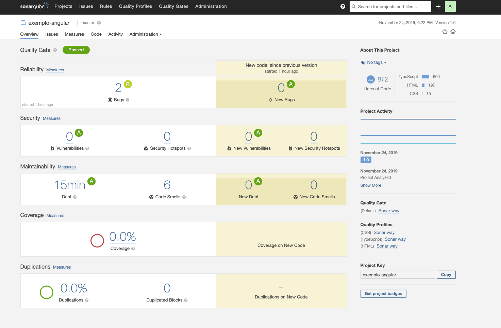
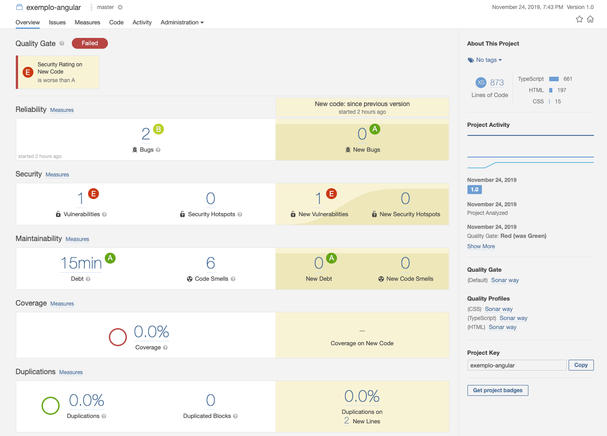

## SonarQube

Execução do SonarQube:

https://docs.sonarqube.org/latest/setup/get-started-2-minutes/




```bash
npm install tslint-sonarts sonar-scanner
```


Arquivo sonar-project.properties

```properties
sonar.projectKey=exemplo-angular
sonar.projectName=exemplo-angular
sonar.projectVersion=1.0
sonar.sourceEncoding=UTF-8
sonar.sources=src
sonar.exclusions=**/node_modules/**,**/*.spec.ts
sonar.tests=src
sonar.test.inclusions=**/*.spec.ts
sonar.ts.tslintconfigpath=tslint.json
sonar.ts.lcov.reportpath=test-results/coverage/coverage.lcov
```

Arquivo tslint.json

```json
{
  "extends": ["tslint:recommended",
    "tslint-sonarts"],
 .
 .
 .
```

Adicionando ao package.json:

```json
“sonar”: “sonar-scanner”
```


Execução do SonarScanner:

```bash
npm run sonar
```

