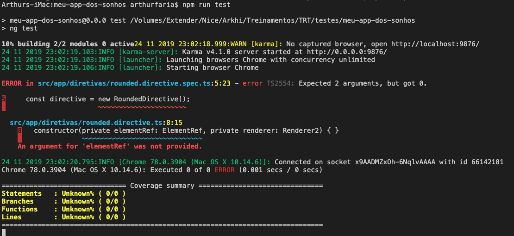

# Testes de Unidade

##### 1. Que sejam curtos

Uma vez que estamos testando um pequeno recurso, fornecido por uma única unidade de código, faz sentido que um teste seja razoavelmente curto. Mas, quão curto? Bem, isso depende de vários fatores, mas geralmente não mais do que algumas linhas de código.

##### 2. Não se repitam

Boas práticas de codificação aplicam-se ao código de teste da mesma forma que se aplicam ao código em produção. Uma das regras mais comumente violadas em testes unitários é DRY. Algumas pessoas afirmam que os testes unitários não devem compartilhar nenhum código. Claro, você quer manter seus testes tão legíveis quanto possível, mas copiar e colar as coisas ao redor não é a solução.

##### 3. Prefira a composição [composition] sobre a herança [inheritance]

Uma vez que você reconheceu os dois pontos anteriores, pode se sentir tentado a criar algum tipo de classe-base para o seu teste que conterá código comum. Se você fizer isso, pare aqui mesmo! Essa classe-base funciona como um ímã para todos os tipos de código compartilhados não relacionados e cresce muito rapidamente até assumir seu projeto, sua empresa e até mesmo seu cão. Proteja seu cão, use a composição!

##### 4. Faça com que sejam rápidos

Os testes unitários são algo que você deve executar quase todo o tempo. Por esse motivo, certifique-se de abolir dependências externas e outras coisas que possam atrasar seus testes. Isso geralmente será bancos de dados, sistemas externos ou operações de arquivos. Ao mesmo tempo, não exagere nisso – o isolamento completo da unidade sob teste também não é uma boa solução.

##### 5. Torne-os deterministas

Testes unitários devem estar funcionando 100% do tempo: 100% de testes significa que tudo está bem (com as unidades, você também precisa de outros tipos de testes). Se os testes da sua unidade parecem falhar, certifique-se de encontrar a causa raiz e a corrija o mais rápido possível.

##### 6. Não ignore os testes

Dado os pontos 4 e 5, é particularmente importante mencionar que adicionar a anotação @Ignore ao seu teste não é uma maneira de consertar a suite de testes. Mas é uma maneira de tornar a suite de testes ainda menos confiável porque agora não está protegendo de bugs de regressão e que tais.

##### 7. Teste seus testes

Sim, você leu direito. Não se trata de escrever testes de seus testes, mas práticas como testes de mutação, desenvolvimento orientado por teste ou frequentes “changing random stuff” na base de código para ver se algum teste falha. Também pode ajudar fazer o exercício mental de tentar chegar a mudanças possíveis no código que os testes não cobririam.

##### 8. Saiba nomear bem seus testes

Não, shouldThrowException não é um bom nome para o teste. Embora não haja a necessidade de cada projeto levar convenções de nomeação extravagantes para os testes, é fundamental saber qual parte do código está quebrado apenas lendo os nomes dos casos de teste que falharam.

##### 9. Uma asserção lógica por teste

Para alcançar o objetivo de poder dizer o que há de errado apenas lendo os nomes dos testes que falharam, é preciso algo mais do que apenas bons nomes. Uma série de coisas verificadas pelo teste unitário deve ser limitadas também. Portanto, um bom teste de unidade deve conter apenas uma afirmação lógica, ou seja, verifique apenas um efeito de output/side do método testado.

##### 10. Desenhe seus testes

Esta é uma meta-dica, que abrange todas as outras dicas neste artigo e todos aqueles que não foram mencionados aqui. Trate seus testes com o mesmo rigor com o qual você trata seu código de produção. Considere os bons princípios e indicadores de design, como o baixo acoplamento entre o código de teste e o código de produção, e também duplicação, dead code e outros. Lembre-se de que uma boa suite de teste pode tornar sua vida muito mais fácil, fazendo com que você se sinta seguro ao mudar e refatorar seu código, enquanto uma suite de teste ruim pode desperdiçar muito tempo e tornar o código quase impossível de alterar depois.

---


Vamos começar tentando executar o comando `npm run test` e verificar o resultado:



A primeira coisa que veremos é a tentativa de executar o teste do nosso componente `rounded.directive.spec`, que imediatamente retorna um erro por problemas de injeção de dependência.

E claro, caso você não tenha os testes da diretiva, você pode executar o comando:

```bash
npm i -D ngx-spec@^2.0.0

ng g ngx-spec:spec diretivas/rounded.directive.ts
```


### Utilizando componente Simples

Teste de Diretiva

```typescript
import { RoundedDirective } from './rounded.directive';
import { TestBed, ComponentFixture } from '@angular/core/testing';
import { Component, DebugElement } from '@angular/core';
import { By } from '@angular/platform-browser';

// Declarando um componente simples
@Component({
  template: `<div id='divDeTesteRoundedDirective' appRounded> Qualquer coisa </div>`
})
class TestRoundedDirectiveComponent {
}
describe('RoundedDirective', () => {
  let component: TestRoundedDirectiveComponent;
  let fixture: ComponentFixture<TestRoundedDirectiveComponent>;
  let divEl: DebugElement;

  beforeEach(() => {
    TestBed.configureTestingModule({
      declarations: [TestRoundedDirectiveComponent, RoundedDirective]
    });
    fixture = TestBed.createComponent(TestRoundedDirectiveComponent);
    component = fixture.componentInstance;
    divEl = fixture.debugElement.query(By.css('#divDeTesteRoundedDirective'));
    console.log(divEl.nativeElement)
  });


  it('hovering over input', () => {
    let mouseLeave = new Event('mouseleave');

    divEl.triggerEventHandler('mouseenter', null);
    fixture.detectChanges();
    expect(divEl.nativeElement.style.backgroundColor).toBe('rgb(248, 248, 248)');

    divEl.nativeElement.dispatchEvent(mouseLeave);
    fixture.detectChanges();
    expect(divEl.nativeElement.style.backgroundColor).toBe('white');
  });
});

```


### Injetando dependências

Teste de componente de tela com formulário e Rotas `tarefas/tarefas.component.spec.ts`

```typescript
import { async, ComponentFixture, TestBed } from '@angular/core/testing';

import { TarefasComponent } from './tarefas.component';
import { TarefasService } from '../services/tarefas.service';
import { TarefaCardComponent } from './tarefa-card/tarefa-card.component';
import { HttpClientModule } from '@angular/common/http';
import { FormsModule, ReactiveFormsModule } from '@angular/forms';
import { CommonModule } from '@angular/common';
import { RouterModule } from '@angular/router';

describe('TarefasComponent', () => {
  let component: TarefasComponent;
  let fixture: ComponentFixture<TarefasComponent>;

  beforeEach(async(() => {
    TestBed.configureTestingModule({
      declarations: [ TarefasComponent, TarefaCardComponent ],
      providers: [TarefasService],
      imports: [
        FormsModule,
        CommonModule,
        ReactiveFormsModule,
        HttpClientModule,
        RouterModule.forRoot(
          [
            { path: "", component: TarefasComponent}
          ]
        )
      ]
    })
    .compileComponents();
  }));

  beforeEach(() => {
    fixture = TestBed.createComponent(TarefasComponent);
    component = fixture.componentInstance;
    fixture.detectChanges();
  });

  it('should create', () => {
    expect(component).toBeTruthy();
  });
});

```


### Testando Input e Ouput

`consults-element.component.spec.ts`

```typescript
import { async, ComponentFixture, TestBed } from '@angular/core/testing';

import { ConsultaElementComponent } from './consulta-element.component';
import { Consulta } from '../consulta'
describe('ConsultaElementComponent', () => {
  let component: ConsultaElementComponent;
  let fixture: ComponentFixture<ConsultaElementComponent>;

  beforeEach(async(() => {
    TestBed.configureTestingModule({
      declarations: [ ConsultaElementComponent ]
    })
    .compileComponents();
  }));

  beforeEach(() => {
    fixture = TestBed.createComponent(ConsultaElementComponent);
    component = fixture.componentInstance;
    fixture.detectChanges();
  });

  xit('should create', () => {
    expect(component).toBeTruthy();
  });
  it('should receive props and bind them, emiting', (done) => {
      let consulta = new Consulta(0, true, 'teste');
      let index = 0;
      component.consulta = consulta;
      component.index = index;
      component.deleteConsulta.subscribe((resposta) => {
        expect(resposta.index).toBe(index)
        done()
      })
      component.onDeleteConsulta(index);
      fixture.detectChanges();
  })
});

```


### Testando um Serviço com conexão HTTP

`services/consulta.service.spec.ts`

```typescript
import { TestBed } from '@angular/core/testing';

import { ConsultaService } from './consulta.service';
import { HttpTestingController, HttpClientTestingModule } from '@angular/common/http/testing';

describe('ConsultaService', () => {
  let service: ConsultaService;
  let httpMock: HttpTestingController;

  beforeEach(() => {

    TestBed.configureTestingModule({
      imports: [HttpClientTestingModule],
      providers: [ConsultaService]
    })
    service = TestBed.get(ConsultaService);
    httpMock = TestBed.get(HttpTestingController);
  });
  afterEach(() => {
      httpMock.verify();
  });

  it('should get a response with success', (done) => {
    let response = {
      "message": "success"
    }
    service.getConsulta('http://localhost:8080/status')
    const request = httpMock.expectOne( `http://localhost:8080/status`);
    setTimeout(() => {
      expect(service.historico[0].message).toContain('success')
      expect(service.historico[0].online).toBe(true)
      done()
    }, 1000)
    expect(request.request.method).toBe('GET');
    request.flush(response);
  });
  it('should handle a response with error', (done) => {
    let response = {
      status: 400, statusText: 'Bad Request'
    }
    service.getConsulta('http://localhost:8080/error/400')
    const request = httpMock.expectOne( `http://localhost:8080/error/400`)
    setTimeout(() => {
      expect(service.historico[0].message).toContain('400')
      expect(service.historico[0].online).toBe(false)
      done()
    }, 1000)
    expect(request.request.method).toBe('GET');
    request.flush('Invalid Request', response);
  });
});

```


### Exercício

Agora escreva testes para o serviço de Tarefa, cartão de tarefa e a lista de tarefas.

No serviço:

- Verificar se requisições HTTP são enviadas da forma correta

- Verificar se tarefas são carregadas

  

No componente de cartão de tarefa:

- Verificar se são emitidos eventos corretamente
- Verificar se ao passar uma tarefa como propriedade, ela é carregada no componente


No componente de tarefas:

- Verificar se ao chamar os métodos de `editTarefa` e `cancelaEdicao` o comportamento das variáveis é adequado
- Verificar se é feita uma chamada HTTP sempre que os métodos `salvaEdicao`, `toggleTarefa`,  e `deleteTarefa` são chamados