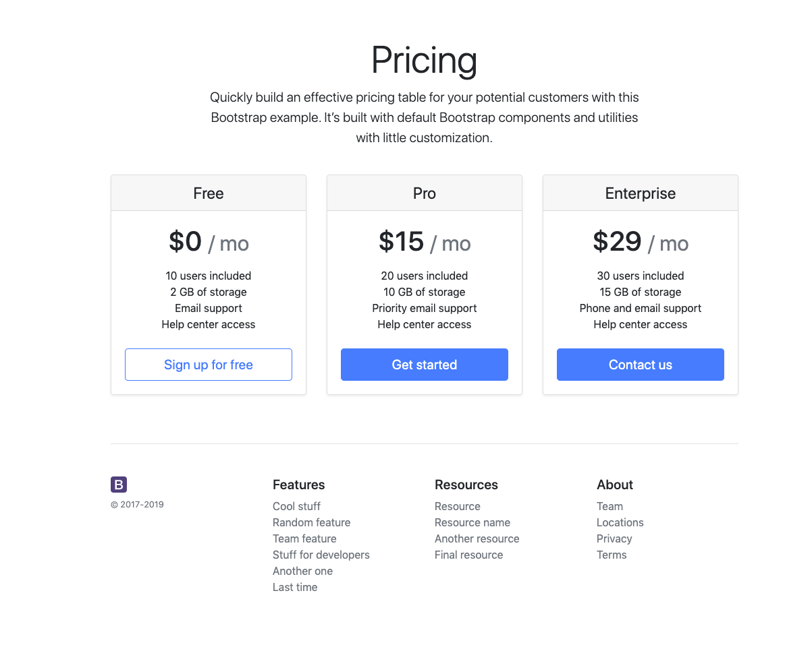
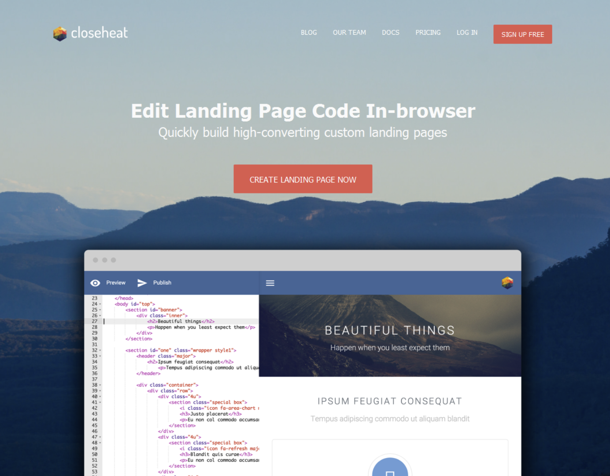
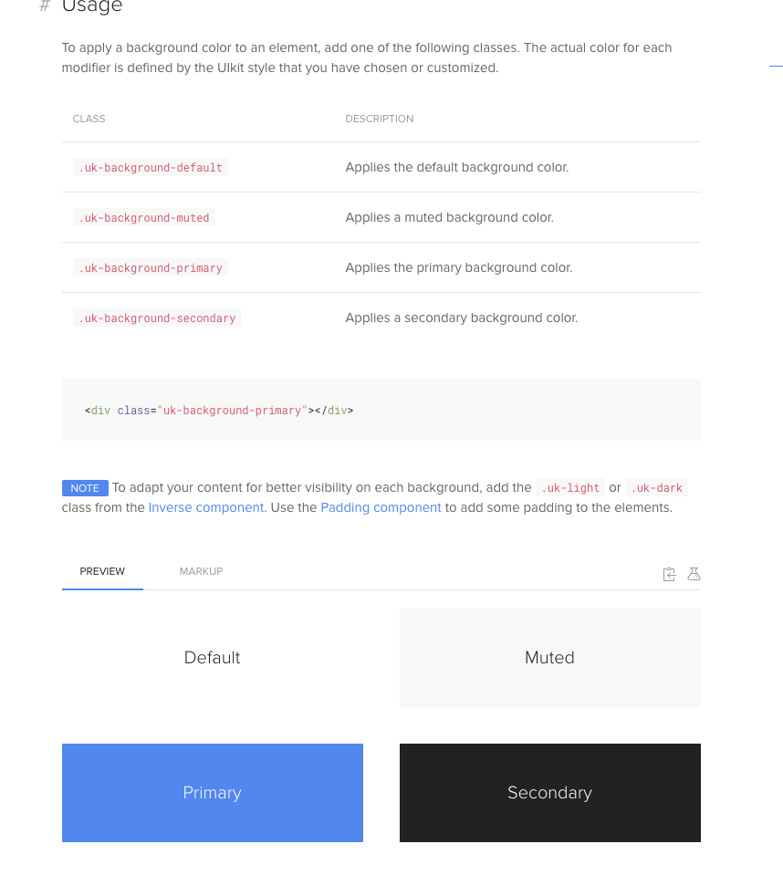
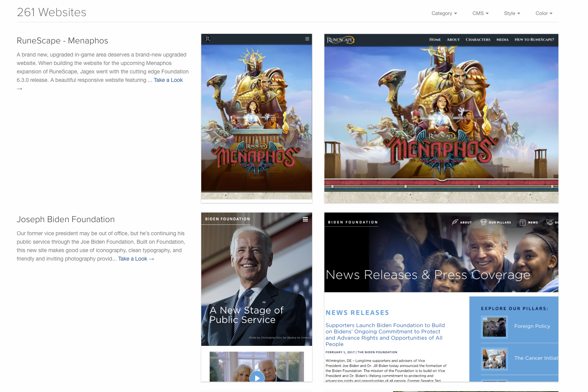
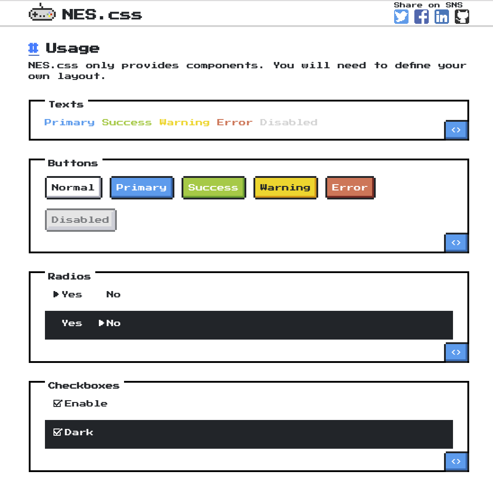

# Estilos

Agora que conseguimos adicionar funcionalidade extra em nossa aplicação, vamos tentar deixá-la um pouco mais elegante, implementando uma biblioteca de estilos :)

Existem inúmeros frameworks de estilos disponíveis na internet, mas aqui listaremos alguns:


1. [Bootstrap](https://getbootstrap.com/)

   

   De longe o framework mais utilizado. Fácil de aprender, com várias funcionalidades e componentes já implementados. O design parece um pouco antigo, já que não adota as práticas minimalistas como os outros da lista.

   Pode ser instalado como dependência através do comando:

   ```bash
   npm install bootstrap @fortawesome/fontawesome-free jquery popper.js
   ```

   E para importar, basta adicionar no arquivo `script.js` os comandos:

   ```js
   import 'bootstrap'
   import 'bootstrap/dist/css/bootstrap.css'
   import '@fortawesome/fontawesome-free/css/all.css' // Para fonte de ícones
   ```

   E agora é só adicionar o componente na página, como por exemplo, um botão simples:

   ```html
   <button type="button" class="btn btn-primary">Primary</button>
   ```

   

2. [MaterializeCSS](https://materializecss.com/)

   

   Um dos frameworks mais familiares da lista, já que é totalmente baseado na *guideline* de [*Material Design*](https://material.io/) da Google.

   Para instalar também é bem simples, basta executar o comando:

   ```bash
   npm install materialize-css@next material-icons
   ```

   E para importar:

   ```js
   import 'materialize-css'
   import 'materialize-css/dist/css/materialize.min.css'
   import 'material-icons/iconfont/material-icons.scss';
   ```

   Um exemplo de botão:

   ```html
   <a class="waves-effect waves-light btn"><i class="material-icons left">cloud</i>button</a>
   ```

   

3. [UI Kit](https://getuikit.com/)

   

   De longe o mais minimalista, optando por um design bem limpo, com fontes finas e formas retangulares.

   ```bash
   npm install uikit
   ```

   Para importar:

   ```js
   import 'uikit'
   import 'uikit/dist/css/uikit.min.css'
   ```

   E claro, um exemplo de botão:

   ```html
   <button class="uk-button uk-button-default"> Button </button>
   ```

   

4. [Foundation](https://foundation.zurb.com/sites/getting-started.html)

   

   Um dos frameworks mais completos da lista, que além de ter uma ótima responsividade, possui também algumas funcionalidades de acessibilidade.

   ```bash
   npm install foundation-sites
   ```

   Para importar:

   ```js
   import 'foundation-sites'
   import 'foundation-sites/dist/css/foundation.min.css'
   ```

   Para testar:

   ```html
   <div class="button-group">
     <a class="button">One</a>
     <a class="button">Two</a>
     <a class="button">Three</a>
   </div>
   ```

5. [NES.css](https://nostalgic-css.github.io/NES.css/)

   

   Para os que gostam de sentir um sabor nostálgico ao entrar na página, o NES.css vem a calhar. Contando com um visual retrô bem parecido com os jogos do século passado.

   Para instalar, da mesma maneira dos anteriores:

   ```bash
   npm install nes.css
   ```

   Agora, para utilizar, basta importar o CSS:

   ```js
   import 'nes.css/css/nes.min.css'
   
   // E claro, caso também queira utilizar a fonte, é necessário importá-la no HTML
   //     <link href="https://fonts.googleapis.com/css?family=Press+Start+2P" rel="stylesheet">
   ```

   Um exemplo de um código de botão:

   ```html
   <button type="button" class="nes-btn is-primary">Primary</button>
   ```

   

### Exercício

Agora que conhecemos um pouco mais sobre estilos, vamos implementar o CRUD de tarefas utilizando também os componentes de um dos frameworks CSS acima.
