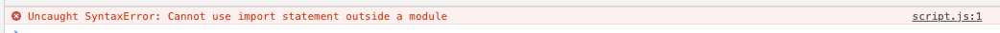

Nos últimos laboratórios, vimos como criar uma página estática em HTML e alguns scripts para incrementar na experiência do usuáiro e na funcionalidade do documento.

Hoje vamos ver como utilizar os pacotes NPM para acrecentar ainda mais.


### Começando

Primeiro, vamos criar uma nova pasta para armazenar os arquivos do nosso projeto, pode chamá-la de `dia2_npm`. Acesse a pasta através de um terminal e execute o comando abaixo para inicializar oficialmente nosso projeto NPM

```bash
npm init -y
```

Agora vamos adicionar uma primeira dependência ao projeto, o Axios, para facilitar a orquestração de chamadas HTTP

```bash
npm install axios
```

Com a dependência instalada, vamos criar dois arquivos, um HTML (chamado `index.html`) e outro JS (chamado `script.js`) com os conteúdos abaixo:

```html
<!DOCTYPE html>
<html>
	<head>
  	<meta charset="UTF-8">
		<title>Titulo de Navegação</title>
    <link href="https://fonts.googleapis.com/css?family=Roboto&display=swap" rel="stylesheet">
	</head>
	<body>
		<style>
      body {
        font-family: 'Roboto', sans-serif;
      }
    </style>
		<h1>Commit Message</h1>
		<p id='resposta'>Parágrafo</p>

    <script src='./script.js'></script>
	</body>
</html>
```

```js
import axios from 'axios';

axios.get('https://gist.githubusercontent.com/triangletodd/759365aa251db39f414a73b508465d94/raw/a3c605e523e3f2994280a243364e50ea88c64fc0/whatthecommit.sorted.log').then( response => {
        let todos = response.data.split('\n')
        document.getElementById("resposta").textContent = todos[Math.floor(Math.random() * todos.length)]
    })
```

Se você tentar executar o código acima, ao abrir o console, o erro será:



E mesmo alterando o código de adição do script no HTML para `<script type="module" src='./script.js'></script> ` ou trocando o `import` para `require` no JS, por proteção do browser e problemas na resolução de dependências, o código não é executado.

Para resolver todos estes problemas, vamos utilizar um pacote chamado [Parcel](https://parceljs.org/).

### Utilizando Parcel

Para instalar o pacote, vamos executar o comando:

```bash
npm install parcel-bundler --save-dev
```

E na sessão de `scripts` do arquivo `package.json`, vamos adicionar comandos para facilitar nossa interação com o pacote:

```json
{
  "scripts": {
    "dev": "parcel index.html",
    "build": "parcel build index.html"
  }
}
```

Agora, ao executar o comando `npm run dev`, o Parcel irá automaticamente verificar as alterações nos arquivos e gerar um novo `compilado`, resolvendo as dependências.

E caso você queira gerar arquivos JS e HTML para publicar em um site, basta executar o comando `npm run build`!


## Exercício

Recarregar a página para mudar a mensagem de commit é um trabalho bastante árduo! Para facilitar ao usuário, vamos adicionar um botão que recarrega a mensagem de commit quando clicado.


### Adicionando outro pacote NPM

Agora que temos um botão para trocar a mensagem, vamos adicionar um pouco de animações na nossa aplicação através de um simples pacote, o `css-animations`.

Vamos instalá-lo através do comando:

```bash
npm install --save animejs
```

Vamos então alterar o nosso `script.js` para importar e animar a página, primeiro importanto a biblioteca:

```js
import anime from 'animejs/lib/anime.es.js';
```

E depois animando o componente (onde `el` representa o componente do documento):

```js
anime.timeline()
  .add({
  targets: '#resposta',
  opacity: [0,1],
  easing: "easeInOutQuad",
  duration: 500
})
```


### Debugando com VS Code

```json
{
    // Use IntelliSense to learn about possible attributes.
    // Hover to view descriptions of existing attributes.
    // For more information, visit: https://go.microsoft.com/fwlink/?linkid=830387
    "version": "0.2.0",
    "configurations": [
      {
        "type": "chrome",
        "request": "launch",
        "name": "Launch Chrome against localhost",
        "url": "http://localhost:1234",
        "webRoot": "${workspaceFolder}",
        "breakOnLoad": true,
        "sourceMaps": true,
        "sourceMapPathOverrides": {
          "*": "${webRoot}/dist/*"
        }
      }
    ]
  }
```

