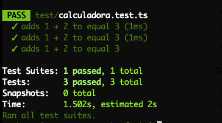

# Adicionando testes com Jest

[Jest é a maneira mais divertida de escrever testes](https://medium.com/@oieduardorabelo/jest-escrever-testes-nunca-foi-tão-divertido-5f0e1950ba10). E em Node.js com TypeScript, não é diferente! Vamos instalar as dependências:

```bash
npm i @types/jest jest ts-jest --save-dev
```

Agora precisamos dizer ao Jest para utilizar o compilador do TypeScript e também procurar por arquivos **.ts**. Vamos adicionar essa configuração extra do Jest no `package.json` :

```
  "jest": {
    "transform": { 
      "^.+\\.ts$": "ts-jest" // [A]
    },
    "testRegex": "\\.test\\.ts", // [B]
    "moduleFileExtensions": [ 
      "ts",
      "tsx",
      "js",
      "jsx",
      "json",
      "node" // [C]
    ]
  }
```

- **[A]:** estamos dizendo ao Jest que, ao encontrar arquivos **.ts** utilize o **ts-jest** como parte da transformação/resolução do módulo
- **[B]:** minha preferência pessoal são arquivos <**nome>.test.js**, sempre co-locados com o arquivo testado, você pode mudar essa RegEx
- **[C]:** precisamos declarar todas essas extensões (podemos omitir **.tsx/jsx** nesse exemplo) pois arquivos de módulos (dentro de **node_modules/**) precisam ser importados pelo Jest e ou qualquer outra dependência


## Implementando uma função testável

Para criar nossa primeira função testável, vamos primeiro adicionar um arquivo na pasta `src` chamado `calculadora.ts`.

Nele vamos implementar o seguinte código:

```typescript
function soma (x: number, y: number): number {
    return x + y;
}
export { soma }
```


Agora, vamos criar uma pasta na raiz do nosso projeto chamada `tests`. Vamos então criar um arquivo chamado `calculadora.test.ts` e adicionar o conteúdo abaixo:

```typescript
import { soma } from '../src/calculadora'

test('adds 1 + 2 to equal 3', () => {
    expect(soma(1, 2)).toBe(3);
  });

  test('adds 1 + 2 to not be equal 5', () => {
    expect(soma(1, 2)).not.toBe(5);
  });

  test('adds -1 + 1 to equal 0', () => {
    expect(soma(-1, 1)).toBe(0);
  });
```


Agora, podemos modificar o script de `test` no nosso arquivo `package.json` para que ele execute o Jest:

```json
  "scripts": {
    "test": "jest",
    "start": "npm run build:live",
    "build": "tsc -p .",
    "build:live": "nodemon --watch 'src/**/*.ts' --exec 'ts-node' src/index.ts",
    "docs": "typedoc ./src --out docs"
  },
```

Pronto! Agora é só executar o comando `npm run test` e conferir o resultado no terminal:




Para mais informações sobre o framework, você pode visitar o [Site Oficial do Jest,](https://jestjs.io/docs/pt-BR/getting-started)